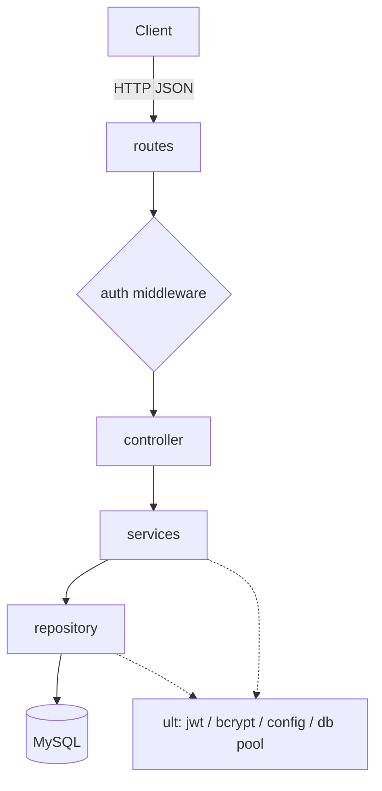

# Architecture

## 1. Style
A single backend service: a stateless Express REST API over MySQL, organised as
layered architecture (`routes -> controller -> services -> repository`). No ORM;
the repository layer issues SQL directly with `mysql2`.

```
Client ──HTTP/JSON──> Express app ──SQL──> MySQL
```

## 2. Components

| Layer        | Folder             | Responsibility                                                        | May depend on |
|--------------|--------------------|----------------------------------------------------------------------|---------------|
| Routes       | `src/routes`       | Map HTTP method + path to a controller; attach auth middleware.       | controller    |
| Controller   | `src/controller`   | Parse/validate the request, call a service, format the HTTP response. | services      |
| Services     | `src/services`     | Business rules: password hashing, FK existence checks, orchestration. | repository    |
| Repository   | `src/repository`   | Parameterized SQL queries; map rows <-> plain objects.                | db pool       |
| Util (`ult`) | `src/ult`          | Cross-cutting helpers: db pool, JWT, bcrypt wrapper, error types, env. | —            |

Dependencies point downward only. A layer never imports from the layer above it.

## 3. Cross-cutting concerns

### 3.1 Configuration
- All config read once at startup from `process.env` (via `dotenv`) into a typed
  `config` object in `src/ult/config.ts`.
- Required vars: `PORT`, `DB_HOST`, `DB_PORT`, `DB_USER`, `DB_PASSWORD`,
  `DB_NAME`, `JWT_SECRET`, `JWT_EXPIRES_IN`.
- Missing required var -> process exits on boot with a clear message.

### 3.2 Database access
- One shared `mysql2/promise` connection pool created in `src/ult/db.ts`.
- Repositories import the pool and call `pool.execute(sql, params)`.
- No transactions required by current scope; add per-service when needed.

### 3.2a File uploads
- `POST /api/files` takes `multipart/form-data`; `multer` (config in
  `src/ult/upload.ts`) writes the binary to `backend/public/upload/<uuid><ext>`.
- The `file` row stores only the URL path (`/upload/<uuid><ext>`) in `detail`.
- `app.ts` mounts `express.static` at `/upload` to serve them (public, no auth).
- Deleting a `file` row also unlinks the on-disk file (best-effort).
- `backend/public/upload/` is git-ignored except for a `.gitkeep`.

### 3.3 Authentication
- `POST /api/auth/login` verifies credentials with bcrypt and issues a JWT.
- `authMiddleware` validates `Authorization: Bearer <token>` on all
  `/api/{admins,customers,files}` routes and attaches `req.admin = { id, username }`.

### 3.4 Error handling
- Services/controllers throw typed errors (`ApiError` with `status`, `message`,
  `details`).
- A single Express error-handling middleware converts them to the JSON error
  model in [functional-design.md](./functional-design.md#3-error-model).
- Unhandled errors -> `500`.

### 3.5 Logging
- Minimal: request line + status via a small middleware; errors logged with
  stack on `500`.

## 4. Runtime & deployment
- Node.js LTS. TypeScript compiled to `dist/` with `tsc`; run `node dist/index.js`.
- Stateless: horizontal scaling is safe; MySQL is the only shared state.
- Schema created by a checked-in SQL migration script (`backend/db/schema.sql`),
  applied manually or by a start script. No ORM migration tooling.

## 5. External dependencies
| Package         | Purpose                    |
|-----------------|----------------------------|
| express         | HTTP framework             |
| mysql2          | MySQL driver (SQL2)        |
| jsonwebtoken    | JWT sign/verify            |
| bcrypt          | password hashing           |
| multer          | `multipart/form-data` parsing for file uploads |
| dotenv          | load `.env`                |
| typescript, ts-node-dev, @types/* | build & dev tooling |
| eslint, prettier (+ @typescript-eslint) | lint & format (see development-guidelines §9) |

## 6. Diagram

